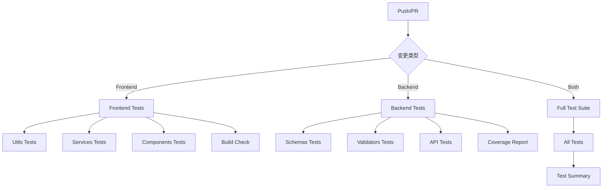

# GitHub Actions Workflows

本项目使用 GitHub Actions 进行持续集成和测试。

## 🚀 Workflows 说明

### 1. Frontend Tests (`frontend-tests.yml`)
**触发条件:**
- Push 到 main/develop 分支（frontend 相关文件变更）
- Pull Request 到 main/develop 分支

**测试内容:**
- ✅ Utils 测试
- ✅ Services 测试 (22个服务)
- ✅ Components 测试 (5个核心组件)
- ✅ 代码覆盖率报告
- ✅ Lint 检查
- ✅ 构建验证

**运行环境:**
- Node.js 18, 20
- pnpm 8
- Ubuntu Latest

**预计时长:** 5-8 分钟

---

### 2. Backend Tests (`backend-tests.yml`)
**触发条件:**
- Push 到 main/develop 分支（backend 相关文件变更）
- Pull Request 到 main/develop 分支

**测试内容:**
- ✅ Schemas 测试
- ✅ Validators 测试
- ✅ API Endpoints 测试
- ✅ 代码覆盖率报告
- ✅ 代码质量检查 (Black, isort, flake8)

**测试服务:**
- PostgreSQL 15
- Redis 7

**运行环境:**
- Python 3.11, 3.12
- Ubuntu Latest

**预计时长:** 6-10 分钟

---

### 3. Full Test Suite (`full-test-suite.yml`)
**触发条件:**
- Push 到 main 分支
- Pull Request 到 main 分支
- 每天 UTC 02:00 定时运行 (北京时间 10:00)
- 手动触发 (workflow_dispatch)

**测试内容:**
- ✅ 完整的后端测试
- ✅ 完整的前端测试
- ✅ 完整的管理前端测试
- ✅ 覆盖率报告

**预计时长:** 15-20 分钟

---

### 4. CI/CD Pipeline (`ci.yml`)
**触发条件:**
- Push 到 main/develop 分支
- Pull Request 到 main/develop 分支

**检查内容:**
- 🔍 代码质量检查
- ⚡ 快速测试（关键路径）
- 🏗️ 构建检查
- 🔒 安全扫描

**预计时长:** 8-12 分钟

---

## 📊 工作流程图



---

## 🎯 测试覆盖率目标

| 模块 | 当前 | 目标 | 状态 |
|------|------|------|------|
| Backend Schemas | ~80% | 90% | 🟢 |
| Backend Validators | ~70% | 85% | 🟢 |
| Backend APIs | ~25% | 60% | 🟡 |
| Frontend Services | ~100% | 100% | 🟢 |
| Frontend Components | ~10% | 40% | 🟡 |
| Frontend Utils | ~30% | 80% | 🟡 |

---

## 📝 使用说明

### 查看测试结果
1. 访问 GitHub 仓库的 **Actions** 标签
2. 选择对应的 Workflow
3. 查看每次运行的详细日志

### 手动触发测试
1. 进入 **Actions** 标签
2. 选择 "Full Test Suite"
3. 点击 "Run workflow" 按钮
4. 选择分支并运行

### 查看覆盖率报告
- 测试运行完成后，覆盖率报告会上传到 Codecov
- 在 PR 中会自动显示覆盖率变化
- 下载 Artifacts 可以查看 HTML 格式的详细报告

### 本地模拟 CI 环境
```bash
# 运行前端测试（与 CI 相同）
cd frontend
pnpm install --frozen-lockfile
pnpm vitest run src/utils/__tests__
pnpm vitest run src/services/__tests__
pnpm vitest run src/components/__tests__
pnpm lint
pnpm build

# 运行后端测试（与 CI 相同）
cd backend
pip install -r requirements.txt
pytest tests/test_schemas.py -v
pytest tests/test_validators.py -v
black --check app/
isort --check-only app/
```

---

## 🔧 配置文件位置

```
.github/
├── workflows/
│   ├── frontend-tests.yml      # 前端专项测试
│   ├── backend-tests.yml       # 后端专项测试
│   ├── full-test-suite.yml     # 完整测试套件
│   └── ci.yml                  # CI/CD 主流程
└── README.md                   # 本文件
```

---

## 🐛 故障排查

### 测试失败怎么办？
1. 查看 Actions 页面的详细日志
2. 在 "Annotations" 中查看具体错误
3. 本地运行失败的测试进行调试
4. 修复后重新提交

### 常见问题

**Q: 为什么有些测试标记为 `continue-on-error: true`?**  
A: 某些测试（如覆盖率、lint）是可选的，不应该阻止 CI 流程。

**Q: 如何跳过 CI 运行？**  
A: 在 commit message 中添加 `[skip ci]` 或 `[ci skip]`

**Q: 如何只运行特定的 workflow？**  
A: 通过修改特定路径的文件来触发对应的 workflow

---

## 📈 持续改进

- [ ] 增加测试覆盖率到 60%
- [ ] 添加 E2E 测试 workflow
- [ ] 添加性能测试
- [ ] 集成 SonarQube 代码质量分析
- [ ] 添加自动部署流程
- [ ] 添加 Docker 镜像构建

---

**💡 提示:** 保持绿色的 CI 状态是代码质量的重要指标！

