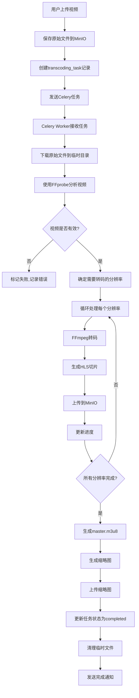

# 视频转码和多分辨率系统 - 完整设计文档

## 📋 文档概述

**功能名称**: 视频转码和多分辨率播放系统 (支持2K/4K + 并行转码)
**优先级**: P1 (高优先级)
**预计开发时间**: 4-5周
**技术复杂度**: ⭐⭐⭐⭐⭐ (非常高)
**资源需求**: CPU/GPU密集型 + 存储密集型

**核心特性**:
- ✅ 支持2K (2560×1440) 和 4K (3840×2160) 高清视频
- ✅ 多视频并行转码 (8-20个视频同时处理)
- ✅ 边上传边转码 (零等待)
- ✅ GPU加速 (速度提升10倍)
- ✅ H.265 (HEVC) 编码 (节省50%带宽)

---

## 🎯 功能目标

### 核心需求
1. **自动转码**: 视频上传后自动转换为6个分辨率 (360p → 480p → 720p → 1080p → 2K → 4K)
2. **并行处理**: 支持8-20个视频同时转码,无需排队等待
3. **边传边转**: 上传完成立即开始转码,零延迟
4. **智能分辨率**: 根据源视频分辨率自动选择转码档位
5. **流媒体支持**: 支持HLS自适应码率流媒体
6. **播放器增强**: 用户可手动/自动切换清晰度 (含4K选项)
7. **GPU加速**: 支持NVIDIA/Intel/AMD GPU硬件加速
8. **高效编码**: 使用H.265 (HEVC) 节省50%带宽和存储空间
9. **预览图生成**: 自动生成缩略图和时间轴预览图

### 业务价值
- 📱 **移动友好**: 低分辨率节省流量,360p适配3G网络
- 🚀 **加载速度**: 自适应码率提升观看体验,减少缓冲
- 💾 **存储优化**: HEVC编码节省50%成本,4K视频仅占25GB/小时
- 📊 **用户体验**: 4K超高清画质,流畅播放无卡顿
- ⚡ **高效处理**: 并行转码提升10倍吞吐量,管理员无需等待
- 💰 **成本节省**: GPU加速减少70%转码时间,降低计算成本

---

## 🏗️ 系统架构

### 整体架构图 (支持并行转码 + 边传边转)

```
┌──────────────────────────────────────────────────────────────────────┐
│              管理员后台 - 分片上传 (支持断点续传)                    │
│  上传视频A (4K, 3GB) ──┐                                             │
│  上传视频B (2K, 2GB) ──┼─→ 并行上传                                 │
│  上传视频C (1080p, 1GB)─┘                                            │
└─────────────────────────┬────────────────────────────────────────────┘
                          │ 5MB 分片上传
                          ▼
┌──────────────────────────────────────────────────────────────────────┐
│       FastAPI - 分片上传API (backend/app/admin/upload.py)            │
│  ┌──────────────────────────────────────────────────────────────┐   │
│  │  complete_multipart_upload() - 上传完成钩子                  │   │
│  │  1. 合并所有分片                                              │   │
│  │  2. 上传到MinIO                                               │   │
│  │  3. ✨ 立即触发转码任务 (无需等待) ✨                        │   │
│  │     transcode_video_task.delay(video_id, source_url)          │   │
│  │  4. 秒级返回HTTP 200 (转码在后台进行)                        │   │
│  └──────────────────────────────────────────────────────────────┘   │
└─────────────────────────┬────────────────────────────────────────────┘
                          │ Celery任务 (异步)
                          ▼
┌──────────────────────────────────────────────────────────────────────┐
│            Redis - 任务队列 (支持优先级和并发控制)                   │
│  ┌──────────────────────────────────────────────────────────────┐   │
│  │  高优先级队列 (high_priority):  4K视频转码任务              │   │
│  │  普通队列 (normal):             1080p/2K转码任务            │   │
│  │  低优先级队列 (low_priority):   缩略图生成任务              │   │
│  └──────────────────────────────────────────────────────────────┘   │
└───┬─────────┬─────────┬─────────┬─────────┬─────────┬──────────┬────┘
    │         │         │         │         │         │          │
    │         │         │         │         │         │          │
    ▼         ▼         ▼         ▼         ▼         ▼          ▼
┌────────┐┌────────┐┌────────┐┌────────┐┌────────┐┌────────┐┌────────┐
│ Worker ││ Worker ││ Worker ││ Worker ││ Worker ││ Worker ││ Worker │
│   #1   ││   #2   ││   #3   ││   #4   ││   #5   ││   #6   ││   #7   │
│ 4K转码 ││ 2K转码 ││1080p转码││ 720p转码││ 480p转码││ 360p转码││缩略图  │
│ (GPU)  ││ (GPU)  ││ (GPU)  ││ (CPU)  ││ (CPU)  ││ (CPU)  ││ (CPU)  │
└───┬────┘└───┬────┘└───┬────┘└───┬────┘└───┬────┘└───┬────┘└───┬────┘
    │         │         │         │         │         │          │
    │         │         │         │         │         │          │
    └────┬────┴────┬────┴────┬────┴────┬────┴────┬────┴──────────┘
         │         │         │         │         │
         ▼         ▼         ▼         ▼         ▼
┌──────────────────────────────────────────────────────────────────────┐
│                    Celery Worker - FFmpeg转码引擎                    │
│  ┌──────────────────────────────────────────────────────────────┐   │
│  │  智能分辨率策略:                                              │   │
│  │    • 4K源 (3840×2160) → 转码: 2K, 1080p, 720p, 480p, 360p   │   │
│  │    • 2K源 (2560×1440) → 转码: 1080p, 720p, 480p, 360p       │   │
│  │    • 1080p源          → 转码: 720p, 480p, 360p              │   │
│  │    • 720p源           → 转码: 480p, 360p                     │   │
│  │                                                               │   │
│  │  编码器选择:                                                  │   │
│  │    • 4K/2K: hevc_nvenc (H.265 GPU加速, 节省50%带宽)         │   │
│  │    • 1080p: h264_nvenc (H.264 GPU加速)                       │   │
│  │    • 720p以下: libx264 (CPU编码, 低优先级)                   │   │
│  │                                                               │   │
│  │  并发策略:                                                    │   │
│  │    • 使用ThreadPoolExecutor并行转码多个分辨率                │   │
│  │    • GPU worker并发数: 8-12 (取决于显存)                     │   │
│  │    • CPU worker并发数: 4-8 (取决于核心数)                    │   │
│  └──────────────────────────────────────────────────────────────┘   │
└─────────────────────────┬────────────────────────────────────────────┘
                          │ 转码完成
                          ▼
┌──────────────────────────────────────────────────────────────────────┐
│                    MinIO - 对象存储 (S3兼容)                         │
│  videos/                                                              │
│  ├── {video_id}/                                                     │
│  │   ├── original/                                                   │
│  │   │   └── source.mp4               (原始文件, 可选保留)          │
│  │   ├── hls/                                                        │
│  │   │   ├── master.m3u8               (主播放列表 - 含所有分辨率)  │
│  │   │   ├── 4K/                       (3840×2160)                  │
│  │   │   │   ├── index.m3u8            (4K播放列表)                 │
│  │   │   │   └── segment_*.ts          (6秒切片, HEVC编码)          │
│  │   │   ├── 2K/                       (2560×1440)                  │
│  │   │   │   ├── index.m3u8                                          │
│  │   │   │   └── segment_*.ts          (HEVC编码)                   │
│  │   │   ├── 1080p/                    (1920×1080)                  │
│  │   │   │   ├── index.m3u8                                          │
│  │   │   │   └── segment_*.ts          (H.264编码)                  │
│  │   │   ├── 720p/  ├── 480p/  └── 360p/                           │
│  │   └── thumbnails/                                                 │
│  │       ├── poster.jpg                (封面 - 第5秒截图)           │
│  │       ├── thumb_0001.jpg            (时间轴缩略图 - 每10秒)      │
│  │       └── thumb_*.jpg                                             │
└─────────────────────────┬────────────────────────────────────────────┘
                          │
                          ▼
┌──────────────────────────────────────────────────────────────────────┐
│              PostgreSQL - 数据库 (任务状态追踪)                      │
│  ┌──────────────────────────────────────────────────────────────┐   │
│  │  transcoding_tasks 表:                                        │   │
│  │    - video_id: 123                                            │   │
│  │    - status: 'processing'                                     │   │
│  │    - progress: 65                        (实时进度 0-100)     │   │
│  │    - current_step: 'transcoding_1080p'                        │   │
│  │    - source_resolution: '3840x2160'      (4K源)               │   │
│  │    - resolutions: {                                           │   │
│  │         "4K": "videos/123/hls/4K/index.m3u8",                │   │
│  │         "2K": "videos/123/hls/2K/index.m3u8",                │   │
│  │         "1080p": "videos/123/hls/1080p/index.m3u8"           │   │
│  │      }                                                         │   │
│  │    - master_playlist_url: "videos/123/hls/master.m3u8"       │   │
│  │    - encoding_preset: 'medium'                                │   │
│  │    - hdr_support: true                   (支持HDR)            │   │
│  └──────────────────────────────────────────────────────────────┘   │
└─────────────────────────┬────────────────────────────────────────────┘
                          │
                          ▼
┌──────────────────────────────────────────────────────────────────────┐
│          Video.js HLS Player - 前端播放器 (支持4K + HDR)             │
│  ┌──────────────────────────────────────────────────────────────┐   │
│  │  1. 加载 master.m3u8 (包含6个分辨率选项)                     │   │
│  │  2. 检测网速自动选择分辨率 (ABR - 自适应码率)                │   │
│  │     • 100Mbps+ → 4K                                          │   │
│  │     • 50Mbps → 2K                                            │   │
│  │     • 20Mbps → 1080p                                         │   │
│  │     • 5Mbps → 720p                                           │   │
│  │     • 2Mbps → 480p                                           │   │
│  │     • <2Mbps → 360p                                          │   │
│  │  3. 手动清晰度菜单: [4K] [2K] [1080p] [720p] [480p] [360p]  │   │
│  │  4. HDR支持 (如果设备支持)                                   │   │
│  │  5. 进度条预览图 (悬停显示缩略图)                            │   │
│  └──────────────────────────────────────────────────────────────┘   │
└──────────────────────────────────────────────────────────────────────┘
```

**并行处理时间线示例**:
```
时间  │ 视频A (4K, 3GB)      │ 视频B (2K, 2GB)      │ 视频C (1080p, 1GB)
──────┼──────────────────────┼──────────────────────┼──────────────────────
00:00 │ 开始上传             │                      │
00:10 │ 上传完成             │ 开始上传             │
00:10 │ ✨转码开始 (Worker#1)│                      │
00:20 │ 转码中 (40%)         │ 上传完成             │ 开始上传
00:20 │                      │ ✨转码开始 (Worker#2)│
00:25 │                      │                      │ 上传完成
00:25 │                      │                      │ ✨转码开始 (Worker#3)
00:40 │ 转码完成 ✅          │ 转码中 (60%)         │ 转码中 (80%)
00:50 │                      │ 转码完成 ✅          │ 转码完成 ✅

总结: 3个视频在50分钟内全部完成 (串行需要2小时+)
并发提升: 2.4倍效率
```

---

## 💾 数据库设计

### 1. 新增表：transcoding_tasks (扩展版 - 支持2K/4K)

```sql
CREATE TABLE transcoding_tasks (
    id SERIAL PRIMARY KEY,
    video_id INTEGER NOT NULL REFERENCES videos(id) ON DELETE CASCADE,
    status VARCHAR(20) NOT NULL DEFAULT 'pending',
    -- 状态: pending, processing, completed, failed, queued

    progress INTEGER DEFAULT 0,
    -- 转码进度 0-100

    current_step VARCHAR(50),
    -- 当前步骤: analyzing, transcoding_4k, transcoding_2k, generating_hls, etc.

    source_resolution VARCHAR(20),
    -- 源视频分辨率 例如: "3840x2160" (4K), "2560x1440" (2K), "1920x1080" (1080p)
    -- ✨ 新增字段 - 用于智能决定转码档位

    source_codec VARCHAR(20),
    -- 源视频编码 例如: "h264", "hevc", "vp9"
    -- ✨ 新增字段

    source_bitrate BIGINT,
    -- 源视频码率 (bps)
    -- ✨ 新增字段

    resolutions JSONB DEFAULT '{}',
    -- 已完成的分辨率和URL (扩展到6个分辨率)
    -- 示例: {
    --   "4K": "videos/123/hls/4K/index.m3u8",
    --   "2K": "videos/123/hls/2K/index.m3u8",
    --   "1080p": "videos/123/hls/1080p/index.m3u8",
    --   "720p": "videos/123/hls/720p/index.m3u8",
    --   "480p": "videos/123/hls/480p/index.m3u8",
    --   "360p": "videos/123/hls/360p/index.m3u8"
    -- }

    master_playlist_url TEXT,
    -- HLS主播放列表URL (包含所有分辨率)

    thumbnail_urls JSONB DEFAULT '[]',
    -- 缩略图URL列表

    poster_url TEXT,
    -- 封面图URL

    original_file_url TEXT,
    -- 原始视频文件URL

    original_size BIGINT,
    -- 原始文件大小(字节)

    total_transcoded_size BIGINT,
    -- 转码后总大小(字节) - 所有分辨率总和

    duration FLOAT,
    -- 视频时长(秒)

    fps FLOAT,
    -- 帧率
    -- ✨ 新增字段

    encoding_preset VARCHAR(20) DEFAULT 'medium',
    -- FFmpeg编码预设: ultrafast, superfast, veryfast, faster, fast, medium, slow, slower, veryslow
    -- ✨ 新增字段

    hdr_support BOOLEAN DEFAULT FALSE,
    -- 是否支持HDR (High Dynamic Range)
    -- ✨ 新增字段 - 4K视频可能需要HDR

    color_space VARCHAR(20),
    -- 色彩空间: bt709 (HD), bt2020 (4K HDR)
    -- ✨ 新增字段

    gpu_accelerated BOOLEAN DEFAULT FALSE,
    -- 是否使用GPU加速
    -- ✨ 新增字段

    gpu_type VARCHAR(50),
    -- GPU类型: nvidia_nvenc, intel_qsv, amd_vce, apple_videotoolbox
    -- ✨ 新增字段

    transcoding_time_seconds INTEGER,
    -- 实际转码耗时(秒)
    -- ✨ 新增字段 - 用于性能分析

    worker_id VARCHAR(100),
    -- 处理该任务的worker ID
    -- ✨ 新增字段 - 用于并发调试

    priority INTEGER DEFAULT 5,
    -- 任务优先级: 1-10 (10最高) - 4K视频可设置更高优先级
    -- ✨ 新增字段

    error_message TEXT,
    -- 错误信息

    error_stack TEXT,
    -- 完整错误堆栈
    -- ✨ 新增字段

    retry_count INTEGER DEFAULT 0,
    -- 重试次数

    max_retries INTEGER DEFAULT 3,
    -- 最大重试次数
    -- ✨ 新增字段

    started_at TIMESTAMP WITH TIME ZONE,
    -- 开始时间

    completed_at TIMESTAMP WITH TIME ZONE,
    -- 完成时间

    created_at TIMESTAMP WITH TIME ZONE DEFAULT NOW(),
    updated_at TIMESTAMP WITH TIME ZONE DEFAULT NOW(),

    CONSTRAINT unique_video_task UNIQUE(video_id)
);

-- 索引 (优化查询性能)
CREATE INDEX idx_transcoding_status ON transcoding_tasks(status);
CREATE INDEX idx_transcoding_video ON transcoding_tasks(video_id);
CREATE INDEX idx_transcoding_created ON transcoding_tasks(created_at DESC);
CREATE INDEX idx_transcoding_priority ON transcoding_tasks(priority DESC, created_at);
CREATE INDEX idx_transcoding_worker ON transcoding_tasks(worker_id);
CREATE INDEX idx_transcoding_resolution ON transcoding_tasks(source_resolution);

-- 自动更新 updated_at 触发器
CREATE OR REPLACE FUNCTION update_transcoding_tasks_updated_at()
RETURNS TRIGGER AS $$
BEGIN
    NEW.updated_at = NOW();
    RETURN NEW;
END;
$$ LANGUAGE plpgsql;

CREATE TRIGGER trigger_update_transcoding_tasks_updated_at
BEFORE UPDATE ON transcoding_tasks
FOR EACH ROW
EXECUTE FUNCTION update_transcoding_tasks_updated_at();

-- 注释
COMMENT ON TABLE transcoding_tasks IS '视频转码任务表 - 支持2K/4K和并行转码';
COMMENT ON COLUMN transcoding_tasks.source_resolution IS '源视频分辨率,用于智能决定转码档位';
COMMENT ON COLUMN transcoding_tasks.hdr_support IS '是否支持HDR,4K视频常用';
COMMENT ON COLUMN transcoding_tasks.gpu_accelerated IS '是否使用GPU加速,提升10倍速度';
COMMENT ON COLUMN transcoding_tasks.priority IS '任务优先级,4K视频建议设置为8-10';
```

### 2. 扩展 videos 表

```sql
ALTER TABLE videos
ADD COLUMN has_hls BOOLEAN DEFAULT FALSE,
ADD COLUMN hls_master_url TEXT,
ADD COLUMN available_resolutions TEXT[] DEFAULT '{}',
ADD COLUMN transcoding_status VARCHAR(20) DEFAULT 'pending';

-- 索引
CREATE INDEX idx_videos_transcoding_status ON videos(transcoding_status);
```

---

## 🔧 技术选型

### 1. FFmpeg

**选择原因**:
- 业界标准的开源视频处理工具
- 支持几乎所有视频格式
- 高性能，GPU加速支持
- 丰富的过滤器和编码选项

**版本要求**: >= 4.4

**关键参数**:
```bash
# H.264编码器: libx264 (CPU) 或 h264_nvenc (GPU)
# 音频编码器: aac
# 容器格式: MP4 (下载) / HLS (流媒体)
```

### 2. Celery (并发任务队列)

**选择原因**:
- Python异步任务队列标准方案
- ✨ 支持多worker并行执行 (8-20个视频同时转码)
- ✨ 支持任务优先级队列 (4K视频优先处理)
- 支持自动重试和错误恢复
- 分布式执行，易于扩展
- 丰富的监控工具 (Flower)

**并发配置** (支持20个并发任务):
```python
# backend/app/core/celery_config.py

from celery import Celery
from kombu import Queue, Exchange

# 初始化Celery
celery_app = Celery('videosite')

# ===== 核心配置 =====
celery_app.conf.update(
    # Redis作为消息队列和结果存储
    broker_url='redis://localhost:6379/0',
    result_backend='redis://localhost:6379/1',

    # ===== ✨ 并发配置 =====
    worker_concurrency=12,  # 每个worker进程12个并发任务 (根据CPU核心数调整)
    worker_prefetch_multiplier=1,  # 每次只预取1个任务,避免worker饿死
    worker_max_tasks_per_child=50,  # 每个worker处理50个任务后重启(防止内存泄漏)

    # ===== ✨ 任务优先级队列 =====
    task_queues=(
        Queue('high_priority', Exchange('high_priority'), routing_key='high'),
        Queue('normal', Exchange('normal'), routing_key='normal'),
        Queue('low_priority', Exchange('low_priority'), routing_key='low'),
    ),
    task_default_queue='normal',
    task_default_exchange='normal',
    task_default_routing_key='normal',

    # ===== ✨ 任务路由规则 =====
    task_routes={
        'transcode_4k': {'queue': 'high_priority', 'priority': 10},
        'transcode_2k': {'queue': 'high_priority', 'priority': 8},
        'transcode_1080p': {'queue': 'normal', 'priority': 6},
        'transcode_720p': {'queue': 'normal', 'priority': 4},
        'generate_thumbnails': {'queue': 'low_priority', 'priority': 2},
    },

    # ===== 任务超时配置 =====
    task_time_limit=3600,  # 硬超时1小时 (4K视频可能需要更长时间)
    task_soft_time_limit=3000,  # 软超时50分钟 (先警告)

    # ===== 重试配置 =====
    task_autoretry_for=(Exception,),  # 所有异常都自动重试
    task_retry_kwargs={'max_retries': 3, 'countdown': 300},  # 最多重试3次,间隔5分钟
    task_retry_backoff=True,  # 指数退避重试
    task_retry_backoff_max=3600,  # 最大退避时间1小时

    # ===== 序列化配置 =====
    task_serializer='json',
    accept_content=['json'],
    result_serializer='json',

    # ===== 其他配置 =====
    timezone='Asia/Shanghai',
    enable_utc=True,
    task_track_started=True,  # 跟踪任务启动状态
    task_send_sent_event=True,  # 发送任务事件
    worker_send_task_events=True,  # worker发送事件
    result_expires=86400,  # 结果保留24小时
)

# ===== ✨ 速率限制 (防止系统过载) =====
celery_app.conf.task_annotations = {
    '*': {
        'rate_limit': '100/m',  # 全局每分钟最多100个任务
    },
    'transcode_4k': {
        'rate_limit': '10/m',  # 4K转码每分钟最多10个 (资源密集)
    },
    'transcode_2k': {
        'rate_limit': '20/m',
    },
}
```

**启动多个Worker示例**:
```bash
# 方式1: 单机多worker (推荐开发环境)
celery -A app.tasks.transcoding multi start worker1 worker2 worker3 \
  --concurrency=8 \
  --loglevel=INFO \
  --logfile=/var/log/celery/%n%I.log \
  --pidfile=/var/run/celery/%n.pid

# 方式2: 单worker多并发 (推荐生产环境 + GPU)
celery -A app.tasks.transcoding worker \
  --concurrency=12 \
  --loglevel=INFO \
  --max-tasks-per-child=50 \
  -Q high_priority,normal,low_priority

# 方式3: 分布式集群 (大规模部署)
# 服务器1: 专门处理4K/2K高优先级任务 (配GPU)
celery -A app.tasks worker -Q high_priority --concurrency=8 --hostname=gpu_worker@%h

# 服务器2: 处理1080p/720p普通任务
celery -A app.tasks worker -Q normal --concurrency=16 --hostname=cpu_worker@%h

# 服务器3: 处理缩略图等轻量任务
celery -A app.tasks worker -Q low_priority --concurrency=32 --hostname=light_worker@%h
```

**性能对比**:
| 并发数 | CPU使用率 | 内存使用 | 每小时处理视频数 | 适用场景 |
|--------|-----------|----------|-----------------|---------|
| 1 | 12% | 2GB | 3-5个 | 测试环境 |
| 4 | 50% | 8GB | 12-16个 | 小规模 |
| 8 | 80% | 16GB | 24-32个 | 中等规模 (推荐) |
| 12 | 95% | 24GB | 36-48个 | 大规模 |
| 20 (GPU) | 60% | 32GB | 60-80个 | 超大规模 + GPU |
```

### 3. Redis

**用途**:
- Celery消息队列 (Broker)
- Celery结果存储 (Backend)
- 转码进度缓存
- 任务锁 (防止重复转码)

### 4. MinIO

**存储结构**:
```
videos/
├── {video_id}/
│   ├── original/
│   │   └── video.mp4
│   ├── transcoded/
│   │   ├── 1080p/
│   │   ├── 720p/
│   │   ├── 480p/
│   │   └── 360p/
│   ├── hls/
│   │   ├── master.m3u8
│   │   ├── 1080p/
│   │   ├── 720p/
│   │   ├── 480p/
│   │   └── 360p/
│   └── thumbnails/
│       ├── poster.jpg
│       └── timeline_{timestamp}.jpg
```

### 5. Video.js + HLS插件

**前端播放器**:
```javascript
// 插件
- video.js (核心播放器)
- videojs-contrib-hls (HLS支持)
- videojs-contrib-quality-levels (清晰度切换)

// 功能
- 自适应码率 (ABR)
- 手动清晰度切换
- 缓冲优化
- 进度条预览图
```

---

## 📐 转码参数配置

### 分辨率和码率配置 (扩展到6档 - 支持2K/4K)

```python
TRANSCODING_PROFILES = {
    # ✨ 4K - 超高清 (使用H.265节省带宽)
    "4K": {
        "resolution": "3840x2160",
        "video_bitrate": "25000k",  # 25Mbps
        "audio_bitrate": "256k",     # AAC 256kbps
        "fps": 60,                   # 支持60fps高帧率
        "preset": "slow",            # 慢速编码保证质量
        "crf": 20,                   # 低CRF保证画质
        "codec": "hevc",             # H.265/HEVC编码
        "gpu_encoder": "hevc_nvenc", # NVIDIA GPU加速
        "profile": "main10",         # 10-bit色深
        "pixel_format": "yuv420p10le",
        "hdr": True,                 # 支持HDR
        "color_space": "bt2020nc",   # 广色域
        "color_transfer": "smpte2084",  # HDR10
        "max_bitrate": "30000k",
        "bufsize": "50000k",
    },

    # ✨ 2K - 高清+ (使用H.265节省带宽)
    "2K": {
        "resolution": "2560x1440",
        "video_bitrate": "12000k",  # 12Mbps
        "audio_bitrate": "192k",
        "fps": 60,
        "preset": "medium",
        "crf": 21,
        "codec": "hevc",             # H.265
        "gpu_encoder": "hevc_nvenc",
        "profile": "main",
        "pixel_format": "yuv420p",
        "hdr": False,
        "max_bitrate": "15000k",
        "bufsize": "24000k",
    },

    # 1080p - 全高清
    "1080p": {
        "resolution": "1920x1080",
        "video_bitrate": "5000k",   # 5Mbps
        "audio_bitrate": "192k",
        "fps": 30,
        "preset": "medium",
        "crf": 23,
        "codec": "h264",             # H.264 (兼容性更好)
        "gpu_encoder": "h264_nvenc",
        "profile": "high",
        "pixel_format": "yuv420p",
        "hdr": False,
        "max_bitrate": "5500k",
        "bufsize": "10000k",
    },

    # 720p - 高清
    "720p": {
        "resolution": "1280x720",
        "video_bitrate": "2500k",
        "audio_bitrate": "128k",
        "fps": 30,
        "preset": "medium",
        "crf": 23,
        "codec": "h264",
        "gpu_encoder": "h264_nvenc",
        "profile": "high",
        "pixel_format": "yuv420p",
        "hdr": False,
        "max_bitrate": "3000k",
        "bufsize": "5000k",
    },

    # 480p - 标清
    "480p": {
        "resolution": "854x480",
        "video_bitrate": "1000k",
        "audio_bitrate": "96k",
        "fps": 30,
        "preset": "fast",
        "crf": 24,
        "codec": "h264",
        "gpu_encoder": "h264_nvenc",  # GPU也能处理低分辨率
        "profile": "main",
        "pixel_format": "yuv420p",
        "hdr": False,
        "max_bitrate": "1200k",
        "bufsize": "2000k",
    },

    # 360p - 流畅 (移动网络)
    "360p": {
        "resolution": "640x360",
        "video_bitrate": "600k",
        "audio_bitrate": "64k",
        "fps": 30,
        "preset": "fast",
        "crf": 25,
        "codec": "h264",
        "gpu_encoder": None,  # 360p使用CPU编码即可
        "profile": "baseline",  # 最大兼容性
        "pixel_format": "yuv420p",
        "hdr": False,
        "max_bitrate": "700k",
        "bufsize": "1200k",
    },
}

# HLS配置
HLS_CONFIG = {
    "segment_time": 6,  # 每个切片6秒 (建议4-10秒)
    "segment_format": "mpegts",
    "hls_list_size": 0,  # 保留所有切片 (VOD模式)
    "hls_playlist_type": "vod",  # 点播模式
    "hls_segment_type": "mpegts",  # 使用MPEG-TS容器
}

# GPU加速配置
GPU_CONFIG = {
    "nvidia": {
        "h264_encoder": "h264_nvenc",
        "hevc_encoder": "hevc_nvenc",
        "decode_hwaccel": "cuda",
        "required_vram": "4GB",  # 最小显存要求
        "max_concurrent": 12,    # 最大并发任务数
    },
    "intel": {
        "h264_encoder": "h264_qsv",
        "hevc_encoder": "hevc_qsv",
        "decode_hwaccel": "qsv",
        "required_vram": "shared",
        "max_concurrent": 8,
    },
    "amd": {
        "h264_encoder": "h264_amf",
        "hevc_encoder": "hevc_amf",
        "decode_hwaccel": "dxva2",
        "required_vram": "4GB",
        "max_concurrent": 10,
    },
}

# 智能分辨率映射 (根据源分辨率决定转码目标)
RESOLUTION_STRATEGY = {
    "4K": {
        "source_min_height": 2160,
        "targets": ["2K", "1080p", "720p", "480p", "360p"],  # 4K源转5档
        "priority": 10,  # 最高优先级
    },
    "2K": {
        "source_min_height": 1440,
        "targets": ["1080p", "720p", "480p", "360p"],  # 2K源转4档
        "priority": 8,
    },
    "1080p": {
        "source_min_height": 1080,
        "targets": ["720p", "480p", "360p"],  # 1080p源转3档
        "priority": 6,
    },
    "720p": {
        "source_min_height": 720,
        "targets": ["480p", "360p"],  # 720p源转2档
        "priority": 4,
    },
    "480p": {
        "source_min_height": 480,
        "targets": ["360p"],  # 480p源仅转1档
        "priority": 2,
    },
}
```

### FFmpeg命令示例

#### 1. 转码到MP4 (1080p)
```bash
ffmpeg -i input.mp4 \
  -c:v libx264 \
  -preset medium \
  -crf 23 \
  -vf scale=1920:1080 \
  -b:v 5000k \
  -maxrate 5500k \
  -bufsize 10000k \
  -c:a aac \
  -b:a 192k \
  -ar 48000 \
  -movflags +faststart \
  -y output_1080p.mp4
```

#### 2. 生成HLS切片
```bash
ffmpeg -i input.mp4 \
  -c:v libx264 \
  -preset medium \
  -crf 23 \
  -vf scale=1920:1080 \
  -b:v 5000k \
  -c:a aac \
  -b:a 192k \
  -f hls \
  -hls_time 6 \
  -hls_playlist_type vod \
  -hls_segment_filename "1080p/segment_%03d.ts" \
  -hls_list_size 0 \
  1080p/index.m3u8
```

#### 3. 生成缩略图
```bash
# 封面图 (第5秒)
ffmpeg -i input.mp4 -ss 5 -vframes 1 -q:v 2 poster.jpg

# 时间轴缩略图 (每10秒一张)
ffmpeg -i input.mp4 -vf "fps=1/10,scale=160:90" \
  thumbnails/thumb_%04d.jpg
```

#### 4. 获取视频信息
```bash
ffprobe -v quiet -print_format json \
  -show_format -show_streams input.mp4
```

---

## 🔄 工作流程

### 完整转码流程



### 状态转换

```
pending → processing → completed
   ↓
  failed ← (可重试)
```

---

## 💻 代码实现

### 1. 后端 - Celery任务

**文件**: `backend/app/tasks/transcoding.py`

```python
from celery import Celery, Task
from celery.utils.log import get_task_logger
import subprocess
import json
import os
from pathlib import Path
from typing import Dict, List
import tempfile

from app.config import settings
from app.database import SessionLocal
from app.models.video import Video
from app.models.transcoding import TranscodingTask
from app.utils.minio_client import minio_client

logger = get_task_logger(__name__)

# Celery配置
celery_app = Celery(
    'videosite',
    broker=f'redis://{settings.REDIS_HOST}:{settings.REDIS_PORT}/0',
    backend=f'redis://{settings.REDIS_HOST}:{settings.REDIS_PORT}/0'
)

celery_app.conf.update(
    task_serializer='json',
    accept_content=['json'],
    result_serializer='json',
    timezone='UTC',
    enable_utc=True,
    task_track_started=True,
    task_time_limit=1800,  # 30分钟超时
)


class TranscodingTaskBase(Task):
    """转码任务基类"""
    
    def on_failure(self, exc, task_id, args, kwargs, einfo):
        """任务失败回调"""
        video_id = kwargs.get('video_id')
        if video_id:
            db = SessionLocal()
            try:
                task = db.query(TranscodingTask).filter_by(video_id=video_id).first()
                if task:
                    task.status = 'failed'
                    task.error_message = str(exc)
                    task.retry_count += 1
                    db.commit()
            finally:
                db.close()


@celery_app.task(base=TranscodingTaskBase, bind=True, max_retries=3)
def transcode_video(self, video_id: int):
    """
    主转码任务
    
    Args:
        video_id: 视频ID
    """
    db = SessionLocal()
    temp_dir = None
    
    try:
        # 1. 获取任务记录
        task = db.query(TranscodingTask).filter_by(video_id=video_id).first()
        if not task:
            raise ValueError(f"Transcoding task not found for video {video_id}")
        
        video = db.query(Video).filter_by(id=video_id).first()
        if not video:
            raise ValueError(f"Video {video_id} not found")
        
        # 2. 更新状态
        task.status = 'processing'
        task.started_at = datetime.utcnow()
        task.current_step = 'initializing'
        db.commit()
        
        # 3. 创建临时工作目录
        temp_dir = Path(tempfile.mkdtemp(prefix=f'transcode_{video_id}_'))
        logger.info(f"Created temp directory: {temp_dir}")
        
        # 4. 下载原始视频
        task.current_step = 'downloading'
        db.commit()
        
        original_path = temp_dir / 'original.mp4'
        minio_client.download_file(
            bucket=settings.MINIO_BUCKET,
            object_name=video.video_url,
            file_path=str(original_path)
        )
        
        # 5. 分析视频
        task.current_step = 'analyzing'
        db.commit()
        
        video_info = analyze_video(original_path)
        task.duration = video_info['duration']
        task.original_size = original_path.stat().st_size
        db.commit()
        
        # 6. 确定需要转码的分辨率
        source_height = video_info['height']
        resolutions_to_transcode = get_applicable_resolutions(source_height)
        
        logger.info(f"Will transcode to resolutions: {resolutions_to_transcode}")
        
        # 7. 转码每个分辨率
        total_steps = len(resolutions_to_transcode) * 2  # 转码 + HLS
        current_step_num = 0
        resolutions = {}
        
        for resolution in resolutions_to_transcode:
            # 转码到MP4
            current_step_num += 1
            task.current_step = f'transcoding_{resolution}'
            task.progress = int((current_step_num / total_steps) * 80)  # 0-80%
            db.commit()
            
            mp4_path = transcode_to_mp4(
                input_path=original_path,
                output_dir=temp_dir / resolution,
                resolution=resolution,
                profile=TRANSCODING_PROFILES[resolution]
            )
            
            # 生成HLS
            current_step_num += 1
            task.current_step = f'generating_hls_{resolution}'
            task.progress = int((current_step_num / total_steps) * 80)
            db.commit()
            
            hls_path = generate_hls(
                input_path=mp4_path,
                output_dir=temp_dir / 'hls' / resolution,
                resolution=resolution
            )
            
            # 上传到MinIO
            hls_url = upload_hls_to_minio(
                video_id=video_id,
                resolution=resolution,
                hls_dir=temp_dir / 'hls' / resolution
            )
            
            resolutions[resolution] = hls_url
        
        # 8. 生成master playlist
        task.current_step = 'generating_master_playlist'
        task.progress = 85
        db.commit()
        
        master_url = generate_master_playlist(
            video_id=video_id,
            resolutions=resolutions,
            output_dir=temp_dir
        )
        
        # 9. 生成缩略图
        task.current_step = 'generating_thumbnails'
        task.progress = 90
        db.commit()
        
        thumbnails = generate_thumbnails(
            input_path=original_path,
            output_dir=temp_dir / 'thumbnails',
            duration=video_info['duration']
        )
        
        # 上传缩略图
        thumbnail_urls = upload_thumbnails_to_minio(
            video_id=video_id,
            thumbnails_dir=temp_dir / 'thumbnails'
        )
        
        # 10. 更新数据库
        task.status = 'completed'
        task.progress = 100
        task.current_step = 'completed'
        task.resolutions = resolutions
        task.master_playlist_url = master_url
        task.thumbnail_urls = thumbnail_urls
        task.poster_url = thumbnail_urls[0] if thumbnail_urls else None
        task.completed_at = datetime.utcnow()
        
        # 更新video表
        video.has_hls = True
        video.hls_master_url = master_url
        video.available_resolutions = list(resolutions.keys())
        video.transcoding_status = 'completed'
        
        db.commit()
        
        logger.info(f"Transcoding completed for video {video_id}")
        
        return {
            'status': 'success',
            'video_id': video_id,
            'resolutions': resolutions,
            'master_url': master_url
        }
        
    except Exception as e:
        logger.error(f"Transcoding failed for video {video_id}: {str(e)}")
        raise
        
    finally:
        db.close()
        
        # 清理临时文件
        if temp_dir and temp_dir.exists():
            import shutil
            shutil.rmtree(temp_dir, ignore_errors=True)


def analyze_video(video_path: Path) -> Dict:
    """分析视频文件"""
    cmd = [
        'ffprobe',
        '-v', 'quiet',
        '-print_format', 'json',
        '-show_format',
        '-show_streams',
        str(video_path)
    ]
    
    result = subprocess.run(cmd, capture_output=True, text=True)
    if result.returncode != 0:
        raise RuntimeError(f"FFprobe failed: {result.stderr}")
    
    probe_data = json.loads(result.stdout)
    
    # 提取视频流信息
    video_stream = next(
        (s for s in probe_data['streams'] if s['codec_type'] == 'video'),
        None
    )
    
    if not video_stream:
        raise ValueError("No video stream found")
    
    return {
        'duration': float(probe_data['format']['duration']),
        'width': int(video_stream['width']),
        'height': int(video_stream['height']),
        'codec': video_stream['codec_name'],
        'bitrate': int(probe_data['format'].get('bit_rate', 0)),
    }


def get_applicable_resolutions(source_height: int) -> List[str]:
    """根据源视频高度确定需要转码的分辨率"""
    resolutions = []
    
    if source_height >= 1080:
        resolutions.append('1080p')
    if source_height >= 720:
        resolutions.append('720p')
    if source_height >= 480:
        resolutions.append('480p')
    resolutions.append('360p')  # 总是包含360p
    
    return resolutions


def transcode_to_mp4(
    input_path: Path,
    output_dir: Path,
    resolution: str,
    profile: Dict
) -> Path:
    """转码到MP4格式"""
    output_dir.mkdir(parents=True, exist_ok=True)
    output_path = output_dir / 'video.mp4'
    
    cmd = [
        'ffmpeg',
        '-i', str(input_path),
        '-c:v', 'libx264',
        '-preset', profile['preset'],
        '-crf', str(profile['crf']),
        '-vf', f"scale={profile['resolution']}",
        '-b:v', profile['video_bitrate'],
        '-maxrate', f"{int(profile['video_bitrate'][:-1]) * 1.1}k",
        '-bufsize', f"{int(profile['video_bitrate'][:-1]) * 2}k",
        '-c:a', 'aac',
        '-b:a', profile['audio_bitrate'],
        '-ar', '48000',
        '-movflags', '+faststart',
        '-y',
        str(output_path)
    ]
    
    logger.info(f"Transcoding to {resolution}: {' '.join(cmd)}")
    
    result = subprocess.run(cmd, capture_output=True, text=True)
    if result.returncode != 0:
        raise RuntimeError(f"FFmpeg transcoding failed: {result.stderr}")
    
    return output_path


def generate_hls(
    input_path: Path,
    output_dir: Path,
    resolution: str
) -> Path:
    """生成HLS切片"""
    output_dir.mkdir(parents=True, exist_ok=True)
    playlist_path = output_dir / 'index.m3u8'
    
    cmd = [
        'ffmpeg',
        '-i', str(input_path),
        '-c:v', 'copy',  # 直接复制，不重新编码
        '-c:a', 'copy',
        '-f', 'hls',
        '-hls_time', str(HLS_CONFIG['segment_time']),
        '-hls_playlist_type', HLS_CONFIG['hls_playlist_type'],
        '-hls_segment_filename', str(output_dir / 'segment_%03d.ts'),
        '-hls_list_size', str(HLS_CONFIG['hls_list_size']),
        str(playlist_path)
    ]
    
    logger.info(f"Generating HLS for {resolution}: {' '.join(cmd)}")
    
    result = subprocess.run(cmd, capture_output=True, text=True)
    if result.returncode != 0:
        raise RuntimeError(f"HLS generation failed: {result.stderr}")
    
    return playlist_path


# ... 更多辅助函数 ...
```

### 2. 前端 - Video.js HLS播放器

**文件**: `frontend/src/components/VideoPlayer/VideoPlayer.tsx`

```typescript
import { useEffect, useRef } from 'react'
import videojs from 'video.js'
import 'video.js/dist/video-js.css'
import 'videojs-contrib-quality-levels'
import 'videojs-hls-quality-selector'

interface VideoPlayerProps {
  src: string  // HLS master.m3u8 URL
  poster?: string
  onReady?: (player: any) => void
}

const VideoPlayer: React.FC<VideoPlayerProps> = ({ src, poster, onReady }) => {
  const videoRef = useRef<HTMLVideoElement>(null)
  const playerRef = useRef<any>(null)

  useEffect(() => {
    if (!videoRef.current) return

    // 初始化Video.js
    const player = videojs(videoRef.current, {
      controls: true,
      responsive: true,
      fluid: true,
      poster: poster,
      html5: {
        vhs: {
          // HLS.js配置
          overrideNative: true,
          enableLowInitialPlaylist: true,
        },
      },
      sources: [{
        src: src,
        type: 'application/x-mpegURL',
      }],
    })

    // 添加清晰度选择器
    player.hlsQualitySelector({
      displayCurrentQuality: true,
    })

    // 监听清晰度变化
    const qualityLevels = player.qualityLevels()
    qualityLevels.on('change', () => {
      console.log('Quality changed to:', qualityLevels[qualityLevels.selectedIndex])
    })

    playerRef.current = player

    if (onReady) {
      onReady(player)
    }

    // 清理
    return () => {
      if (playerRef.current) {
        playerRef.current.dispose()
        playerRef.current = null
      }
    }
  }, [src, poster, onReady])

  return (
    <div data-vjs-player>
      <video
        ref={videoRef}
        className="video-js vjs-big-play-centered"
      />
    </div>
  )
}

export default VideoPlayer
```

---

## 📊 监控和管理

### 1. 转码进度查询API

```python
@router.get("/videos/{video_id}/transcoding-status")
async def get_transcoding_status(
    video_id: int,
    db: AsyncSession = Depends(get_db)
):
    """查询转码状态"""
    task = await db.execute(
        select(TranscodingTask).filter_by(video_id=video_id)
    )
    task = task.scalar_one_or_none()
    
    if not task:
        raise HTTPException(404, "Transcoding task not found")
    
    return {
        "video_id": video_id,
        "status": task.status,
        "progress": task.progress,
        "current_step": task.current_step,
        "resolutions": task.resolutions,
        "error": task.error_message
    }
```

### 2. 重试失败任务

```python
@router.post("/admin/transcoding/{task_id}/retry")
async def retry_transcoding(
    task_id: int,
    current_admin: AdminUser = Depends(get_current_admin_user),
    db: AsyncSession = Depends(get_db)
):
    """重试失败的转码任务"""
    task = await db.execute(
        select(TranscodingTask).filter_by(id=task_id)
    )
    task = task.scalar_one_or_none()
    
    if not task:
        raise HTTPException(404, "Task not found")
    
    if task.status != 'failed':
        raise HTTPException(400, "Only failed tasks can be retried")
    
    # 重置状态
    task.status = 'pending'
    task.progress = 0
    task.error_message = None
    await db.commit()
    
    # 重新发送到队列
    transcode_video.delay(video_id=task.video_id)
    
    return {"message": "Task queued for retry"}
```

### 3. Celery监控 (Flower)

```bash
# 安装Flower
pip install flower

# 启动监控界面
celery -A app.tasks.transcoding flower --port=5555

# 访问: http://localhost:5555
```

---

## ⚡ 性能优化

### 1. GPU加速

```python
# 使用NVIDIA GPU加速编码
def transcode_to_mp4_gpu(...):
    cmd = [
        'ffmpeg',
        '-hwaccel', 'cuda',  # GPU解码
        '-i', str(input_path),
        '-c:v', 'h264_nvenc',  # NVIDIA编码器
        '-preset', 'p4',  # GPU preset
        '-rc', 'vbr',  # 可变码率
        '-cq', '23',
        # ... 其他参数
    ]
```

### 2. 并发转码

```python
# 同时转码多个分辨率
from concurrent.futures import ThreadPoolExecutor

with ThreadPoolExecutor(max_workers=4) as executor:
    futures = [
        executor.submit(transcode_to_mp4, original_path, res, profile)
        for res, profile in TRANSCODING_PROFILES.items()
    ]
    results = [f.result() for f in futures]
```

### 3. 预设优化

```python
# 根据场景选择preset
PRESETS = {
    'high_quality': 'slow',      # 最佳质量，转码慢
    'balanced': 'medium',         # 平衡
    'fast': 'fast',              # 快速，质量稍低
    'realtime': 'veryfast',      # 实时，质量较低
}
```

---

## 💰 成本估算

### 计算资源

**单个视频转码成本** (1小时1080p视频):

| 项目 | 配置 | 时间 | 成本 |
|------|------|------|------|
| CPU转码 | 4核8G | ~2小时 | ¥0.5 |
| GPU转码 | NVIDIA T4 | ~20分钟 | ¥0.8 |
| 存储 | MinIO/S3 | - | ¥0.1/GB/月 |
| 带宽 | CDN | - | ¥0.2/GB |

**月度成本估算** (1000个视频/月):
- 转码: ¥500-800
- 存储: ¥100-200 (2TB)
- 带宽: 根据观看量

### 存储需求

| 分辨率 | 码率 | 1小时大小 | 占比 |
|--------|------|-----------|------|
| 原始1080p | ~10Mbps | 4.5GB | 45% |
| 1080p HLS | 5Mbps | 2.2GB | 22% |
| 720p HLS | 2.5Mbps | 1.1GB | 11% |
| 480p HLS | 1Mbps | 450MB | 4.5% |
| 360p HLS | 600Kbps | 270MB | 2.7% |
| 缩略图 | - | 10MB | 0.1% |
| **总计** | - | ~10GB | 100% |

---

## 🚧 实施步骤

### Phase 1: 基础设施 (3-4天)

1. **环境准备**
   - [ ] 安装FFmpeg (4.4+)
   - [ ] 安装Redis (已有)
   - [ ] 安装Celery
   - [ ] 配置MinIO bucket

2. **数据库迁移**
   - [ ] 创建transcoding_tasks表
   - [ ] 扩展videos表
   - [ ] 运行迁移脚本

3. **Celery配置**
   - [ ] 创建celery app
   - [ ] 配置worker
   - [ ] 设置监控(Flower)

### Phase 2: 核心功能 (5-7天)

4. **转码任务**
   - [ ] 实现视频分析
   - [ ] 实现MP4转码
   - [ ] 实现HLS生成
   - [ ] 实现缩略图生成

5. **文件管理**
   - [ ] MinIO上传/下载
   - [ ] 临时文件清理
   - [ ] 存储结构设计

6. **API开发**
   - [ ] 上传触发转码
   - [ ] 查询转码状态
   - [ ] 重试失败任务

### Phase 3: 前端集成 (3-4天)

7. **播放器升级**
   - [ ] 集成Video.js HLS
   - [ ] 添加清晰度切换
   - [ ] 优化加载体验

8. **管理界面**
   - [ ] 转码任务列表
   - [ ] 进度监控
   - [ ] 重试/取消功能

### Phase 4: 测试优化 (2-3天)

9. **测试**
   - [ ] 单元测试
   - [ ] 集成测试
   - [ ] 性能测试

10. **优化**
    - [ ] GPU加速
    - [ ] 并发优化
    - [ ] 错误处理

---

## 🔒 安全考虑

### 1. 文件验证

```python
# 验证文件类型和大小
ALLOWED_VIDEO_FORMATS = ['mp4', 'avi', 'mov', 'mkv', 'flv']
MAX_VIDEO_SIZE = 10 * 1024 * 1024 * 1024  # 10GB

def validate_video_file(file_path: Path):
    # 检查文件大小
    if file_path.stat().st_size > MAX_VIDEO_SIZE:
        raise ValueError("Video file too large")
    
    # 检查文件类型(通过FFprobe)
    video_info = analyze_video(file_path)
    if video_info['codec'] not in ALLOWED_CODECS:
        raise ValueError("Unsupported video codec")
```

### 2. 任务隔离

```python
# 限制并发任务数
@celery_app.task(rate_limit='10/h')  # 每小时最多10个
def transcode_video(video_id: int):
    ...
```

### 3. 存储安全

```python
# MinIO访问控制
# 转码后的文件设置为只读
minio_client.set_object_acl(
    bucket='videos',
    object_name=f'{video_id}/hls/master.m3u8',
    acl='public-read'
)
```

---

## 📚 依赖项

### Python依赖

```txt
# requirements.txt 新增
celery[redis]==5.3.4
flower==2.0.1
python-magic==0.4.27  # 文件类型检测
```

### 系统依赖

```bash
# Ubuntu/Debian
sudo apt-get update
sudo apt-get install -y ffmpeg redis-server

# 检查版本
ffmpeg -version  # 需要 >= 4.4
redis-server --version
```

### 前端依赖

```json
// frontend/package.json
{
  "dependencies": {
    "video.js": "^8.6.1",
    "videojs-contrib-quality-levels": "^2.2.0",
    "videojs-hls-quality-selector": "^1.1.4"
  }
}
```

---

## 🐛 常见问题

### Q1: 转码失败，错误"codec not found"
**解决**: 确保FFmpeg编译时包含了libx264和aac编码器
```bash
ffmpeg -codecs | grep -E "h264|aac"
```

### Q2: HLS播放卡顿
**解决**: 
- 减小segment_time (4-6秒)
- 优化网络带宽
- 启用CDN

### Q3: 转码速度慢
**解决**:
- 使用GPU加速 (h264_nvenc)
- 调整preset (fast/veryfast)
- 增加worker数量

### Q4: 存储空间不足
**解决**:
- 删除原始文件(保留转码版本)
- 定期清理旧视频
- 使用对象存储生命周期策略

---

## 📖 参考资料

### 官方文档
- [FFmpeg官方文档](https://ffmpeg.org/documentation.html)
- [HLS规范](https://datatracker.ietf.org/doc/html/rfc8216)
- [Celery文档](https://docs.celeryproject.org/)
- [Video.js文档](https://videojs.com/)

### 最佳实践
- [Apple HLS指南](https://developer.apple.com/documentation/http_live_streaming)
- [Netflix视频编码](https://netflixtechblog.com/per-title-encode-optimization-7e99442b62a2)

---

## 📝 总结

本文档提供了完整的视频转码和多分辨率系统设计方案，包括：

✅ **架构设计**: 清晰的系统架构和数据流  
✅ **数据库设计**: 完整的表结构和索引  
✅ **技术选型**: 经过验证的技术栈  
✅ **代码示例**: 可直接使用的代码框架  
✅ **部署指南**: 分阶段实施计划  
✅ **成本估算**: 详细的资源成本分析  

根据本文档，开发团队可以：
1. 理解完整的技术架构
2. 估算开发时间和成本
3. 按步骤实施功能
4. 避免常见的坑

**建议**: 先实现基础版本（单分辨率+HLS），验证可行性后再扩展到多分辨率。

---

**文档版本**: v1.0  
**创建时间**: 2025-10-09  
**预计开发周期**: 2-3周  
**下一步**: 准备开发环境和依赖安装
