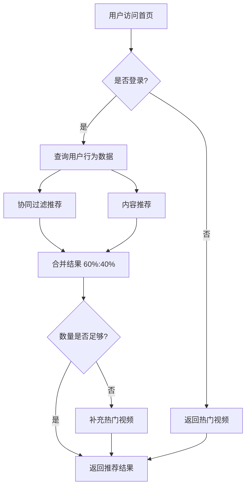
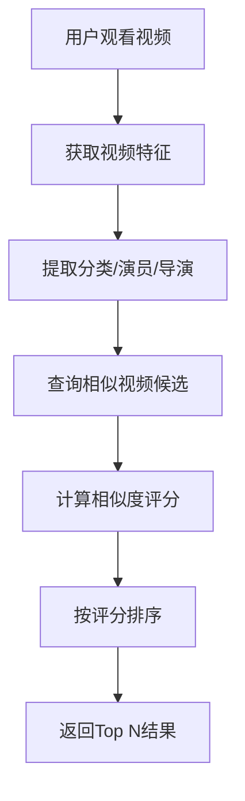

# 智能推荐系统文档

## 📋 概述

VideoSite的智能推荐系统采用混合推荐策略，结合协同过滤和基于内容的推荐算法，为用户提供个性化的视频推荐服务。

## 🎯 核心功能

### 1. 个性化推荐（Personalized Recommendations）
- **位置**：首页"为你推荐"板块
- **策略**：
  - 已登录用户：60% 协同过滤 + 40% 内容推荐
  - 未登录用户：100% 热门视频推荐
- **数量**：最多20个视频

### 2. 相似视频推荐（Similar Videos）
- **位置**：视频详情页"相似推荐"板块
- **策略**：基于视频特征的相似度计算
- **特征维度**：
  - 分类（40%权重）
  - 演员（30%权重）
  - 导演（20%权重）
  - 国家（5%权重）
  - 评分（5%权重）
- **数量**：最多10个视频

### 3. 首页推荐（For You）
- **位置**：首页专属推荐区
- **策略**：与个性化推荐相同
- **数量**：12个视频

## 🔧 技术架构

### 后端架构

#### 1. 推荐引擎核心 (`recommendation_engine.py`)

```python
class RecommendationEngine:
    """推荐引擎核心类"""
    
    async def get_personalized_recommendations(user_id, limit, exclude_ids)
    async def get_similar_videos(video_id, limit, exclude_ids)
    async def _get_collaborative_filtering_recommendations(...)
    async def _get_content_based_recommendations(...)
    async def _get_popular_videos(...)
    def _calculate_similarity_score(...)
```

**关键方法**：

1. **协同过滤推荐**：
```python
async def _get_collaborative_filtering_recommendations(user_id, limit, exclude_ids):
    # 1. 获取用户观看历史和收藏
    # 2. 找到有相似行为的用户（观看相同视频）
    # 3. 推荐这些用户喜欢的视频（基于收藏数）
    # 4. 返回推荐结果
```

2. **内容推荐**：
```python
async def _get_content_based_recommendations(user_id, limit, exclude_ids):
    # 1. 分析用户最近20个观看记录
    # 2. 统计偏好：分类、演员、导演、国家
    # 3. 找出最常见的偏好（Top 3分类，Top 3演员，Top 2导演）
    # 4. 推荐符合这些偏好的高评分视频
```

3. **相似度计算**：
```python
def _calculate_similarity_score(video1, video2):
    score = 0.0
    # 分类相似度：Jaccard系数 * 0.4
    # 演员相似度：Jaccard系数 * 0.3
    # 导演相似度：Jaccard系数 * 0.2
    # 国家相同：0.05
    # 评分相近：(1 - |rating1 - rating2| / 10) * 0.05
    return score
```

#### 2. API端点 (`recommendations.py`)

**路由列表**：

| 端点 | 方法 | 说明 | 认证 |
|------|------|------|------|
| `/api/v1/recommendations/personalized` | GET | 个性化推荐 | 可选 |
| `/api/v1/recommendations/similar/{video_id}` | GET | 相似视频推荐 | 否 |
| `/api/v1/recommendations/for-you` | GET | 首页推荐 | 可选 |

**参数说明**：

```typescript
// GET /api/v1/recommendations/personalized
{
  limit?: number          // 推荐数量，默认20，最大100
  exclude_ids?: string    // 排除的视频ID，逗号分隔，如 "1,2,3"
}

// GET /api/v1/recommendations/similar/{video_id}
{
  limit?: number          // 推荐数量，默认10，最大50
  exclude_ids?: string    // 排除的视频ID
}

// GET /api/v1/recommendations/for-you
{
  limit?: number          // 推荐数量，默认20，最大100
}
```

### 前端架构

#### 1. 推荐服务 (`recommendationService.ts`)

```typescript
export const recommendationService = {
  getPersonalizedRecommendations: async (limit, excludeIds) => Video[]
  getSimilarVideos: async (videoId, limit) => Video[]
  getForYouRecommendations: async (limit) => Video[]
}
```

#### 2. 页面集成

**首页集成**：
```typescript
// Home/index.tsx
const { data: forYouVideos } = useQuery({
  queryKey: ['for-you-videos'],
  queryFn: () => recommendationService.getForYouRecommendations(12),
})

// 显示"为你推荐"板块（仅当有推荐结果时显示）
```

**视频详情页集成**：
```typescript
// VideoDetail/index.tsx
const { data: similarVideos } = useQuery({
  queryKey: ['similar-videos', id],
  queryFn: () => recommendationService.getSimilarVideos(Number(id), 6),
  enabled: !!id,
})

// 显示"相似推荐"板块
```

## 🧮 算法详解

### 协同过滤（Collaborative Filtering）

**原理**：基于"相似用户喜欢相似内容"的假设

**步骤**：
1. **找相似用户**：
   - 计算用户间的观看重叠度
   - 取Top 20个最相似的用户
   
2. **收集推荐**：
   - 获取这些用户的收藏列表
   - 按收藏次数排序
   
3. **过滤结果**：
   - 排除当前用户已观看的视频
   - 排除当前用户已收藏的视频

**优点**：
- 能发现用户未知的兴趣点
- 推荐多样性高

**缺点**：
- 冷启动问题（新用户无数据）
- 需要足够的用户行为数据

### 基于内容推荐（Content-Based）

**原理**：基于"用户喜欢的内容有共同特征"的假设

**步骤**：
1. **用户画像**：
   - 分析最近20个观看记录
   - 统计分类、演员、导演、国家的偏好

2. **特征提取**：
   - Top 3 分类（如：动作、科幻、喜剧）
   - Top 3 演员（如：Tom Cruise、成龙、周星驰）
   - Top 2 导演（如：诺兰、张艺谋）

3. **内容匹配**：
   - 查找包含这些特征的视频
   - 按评分和观看次数排序

**优点**：
- 解决冷启动问题
- 推荐可解释性强

**缺点**：
- 推荐范围受限（仅推荐相似内容）
- 缺乏探索性

### 相似度计算（Similarity Score）

**Jaccard相似度**：
```
J(A, B) = |A ∩ B| / |A ∪ B|
```

**示例**：
```
视频A分类：[动作, 科幻, 冒险]
视频B分类：[科幻, 冒险, 惊悚]

交集：{科幻, 冒险} = 2个
并集：{动作, 科幻, 冒险, 惊悚} = 4个
相似度 = 2/4 = 0.5
```

**综合评分**：
```python
总分 = 分类相似度 * 0.4 
     + 演员相似度 * 0.3 
     + 导演相似度 * 0.2 
     + 国家相同 * 0.05 
     + 评分相近 * 0.05
```

## ⚡ 性能优化

### 1. 缓存策略

**后端Redis缓存**：
```python
# 个性化推荐：10分钟TTL
cache_key = f"personalized_recommendations:user_{user_id}:limit_{limit}"
await Cache.set(cache_key, recommendations, ttl=600)

# 相似视频：30分钟TTL
cache_key = f"similar_videos:video_{video_id}:limit_{limit}"
await Cache.set(cache_key, similar_videos, ttl=1800)

# 热门视频：15分钟TTL
cache_key = f"popular_videos:limit_{limit}"
await Cache.set(cache_key, popular_videos, ttl=900)
```

**前端TanStack Query缓存**：
```typescript
// 自动缓存和重用数据
const { data } = useQuery({
  queryKey: ['for-you-videos'],
  queryFn: () => recommendationService.getForYouRecommendations(12),
  staleTime: 5 * 60 * 1000,  // 5分钟内使用缓存
})
```

### 2. 查询优化

**预加载关联数据**：
```python
query = select(Video).options(
    selectinload(Video.country),
    selectinload(Video.video_categories),
    selectinload(Video.video_actors),
    selectinload(Video.video_directors)
)
```

**限制查询数量**：
```python
# 协同过滤只取前20个相似用户
.limit(20)

# 内容推荐只分析最近20个观看记录
.order_by(desc(WatchHistory.updated_at)).limit(20)
```

### 3. 降级策略

```python
if user_id:
    # 尝试个性化推荐
    collaborative = await get_collaborative_filtering(...)
    content_based = await get_content_based(...)
    
    # 如果推荐不足，用热门视频补充
    if len(recommendations) < limit:
        popular = await get_popular_videos(...)
        recommendations.extend(popular)
else:
    # 未登录用户直接返回热门视频
    return await get_popular_videos(limit)
```

## 📊 数据流程

### 个性化推荐流程



### 相似视频推荐流程



## 🧪 测试

### API测试

```bash
# 1. 测试个性化推荐（未登录）
curl "http://localhost:8001/api/v1/recommendations/personalized?limit=10"

# 2. 测试个性化推荐（已登录）
curl -H "Authorization: Bearer YOUR_TOKEN" \
  "http://localhost:8001/api/v1/recommendations/personalized?limit=10"

# 3. 测试相似视频推荐
curl "http://localhost:8001/api/v1/recommendations/similar/1?limit=10"

# 4. 测试"为你推荐"
curl "http://localhost:8001/api/v1/recommendations/for-you?limit=12"
```

### 前端测试

1. **首页测试**：
   - 访问 http://localhost:3000
   - 检查"为你推荐"板块是否显示
   - 登录后刷新，验证推荐是否变化

2. **视频详情页测试**：
   - 访问任意视频详情页
   - 检查"相似推荐"板块是否显示
   - 点击相似视频，验证推荐准确性

## 📈 效果评估指标

### 1. 准确性指标

- **点击率（CTR）**：推荐视频被点击的比例
- **观看完成率**：推荐视频被看完的比例
- **收藏率**：推荐视频被收藏的比例

### 2. 多样性指标

- **类别覆盖率**：推荐覆盖的分类数量
- **新鲜度**：推荐新发布视频的比例

### 3. 用户满意度

- **停留时间**：用户在平台停留的时间
- **回访率**：用户再次访问的比例

## 🔮 未来优化方向

### 1. 算法增强

- [ ] **深度学习推荐**：使用神经网络学习用户偏好
- [ ] **序列推荐**：考虑用户观看顺序的时序模型
- [ ] **多臂老虎机**：探索vs利用的平衡（Exploration vs Exploitation）
- [ ] **上下文感知**：考虑时间、设备、场景等因素

### 2. 数据增强

- [ ] **隐式反馈**：观看时长、拖动进度条等行为
- [ ] **社交关系**：好友推荐、热门分享
- [ ] **评论分析**：从评论中提取情感和主题
- [ ] **标签扩展**：自动生成视频标签

### 3. 性能优化

- [ ] **实时计算**：Spark Streaming处理用户行为
- [ ] **离线训练**：定期更新推荐模型
- [ ] **向量化检索**：使用Faiss加速相似度搜索
- [ ] **分布式缓存**：Redis Cluster扩展缓存

### 4. 用户体验

- [ ] **推荐解释**：告诉用户为什么推荐这个视频
- [ ] **负反馈**：允许用户"不感兴趣"
- [ ] **推荐控制**：用户自定义推荐偏好
- [ ] **A/B测试**：对比不同推荐策略效果

## 📚 相关资源

### 论文
- [Item-Based Collaborative Filtering Recommendation Algorithms](https://dl.acm.org/doi/10.1145/371920.372071)
- [Content-Based Recommendation Systems](https://link.springer.com/chapter/10.1007/978-0-387-85820-3_3)
- [Matrix Factorization Techniques for Recommender Systems](https://ieeexplore.ieee.org/document/5197422)

### 开源项目
- [Surprise](http://surpriselib.com/) - Python推荐系统库
- [LightFM](https://github.com/lyst/lightfm) - 混合推荐模型
- [TensorFlow Recommenders](https://www.tensorflow.org/recommenders)

## 📝 提交记录

- **后端**: Commit 7d4c047 - "feat: 实现智能推荐系统 - 后端核心算法"
- **前端**: Commit 4aabb0e - "feat: 前端集成智能推荐系统"

## 🔗 相关文档

- [SEARCH_ENHANCEMENT.md](./SEARCH_ENHANCEMENT.md) - 搜索增强功能
- [PLATFORM_STATUS.md](./PLATFORM_STATUS.md) - 平台状态
- [CLAUDE.md](./CLAUDE.md) - 项目开发指南
